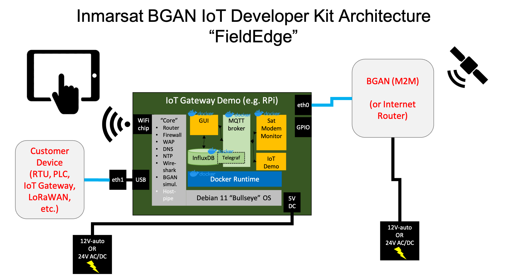

# Inmarsat BGAN(M2M) IoT Developer Kit Quick Start

The BGAN IoT Developer Kit comes with everything you need to start working with
Inmarsat's IP IoT connectivity service ***BGAN(M2M)***:
    
* A satellite modem, self-contained with antenna and GNSS in a weatherproof
enclosure
* Cables to connect to AC or 12VC DC power, including an international power
adapter, cable extenders and a magnetic roof-mount for the satellite modem
if applicable
* A single-board computer (SBC) with interface to the satellite modem, which
provides:
    * WiFi access point for your laptop, tablet or smartphone to acccess a
    the FieldEdge Graphical User Interface (GUI)
    * A Graphical User Interface to the satellite modem and SBC
    * BGAN simulation and packet capture/analysis tools
    * Router and firewall tools for preventing unexpected data use
    * A simple demo "Edge" application that generates location and modem
    telemetry data and allows sending/receiving text messages

## Before you begin...

>:information_source: Inmarsat provides the Developer Kit to qualified
[***ELEVATE***](https://www.inmarsat.com/en/solutions-services/enterprise/services/elevate.html)
partners.

1. You will need a [GitHub](https://github.com) account. Create one for free if
you do not already have one, and send it to your Inmarsat *Elevate* point of
contact. We will set you up with *collaborator* access to our private
repositories.

2. You should have received the **BGAN IoT Developer Kit Welcome Email** from
Inmarsat:

    

3. You should also have received login instructions for the
[Inmarsat Solutions Gateway Portal](https://gateway.inmarsat.com).

> If you have not received your welcome email and login instructions
please contact enterprisesales@inmarsat.com

## Getting Started

We recommend you read the full contents, but if you want to jump-start go
straight to [Modem Activation](docs/modem-activation.md) then
[Kit Installation](docs/kit-installation.md) then
[Network Data](docs/Network-Data.md)

* [System Overview](docs/system-overview.md)
* [BGAN Simulation & Data Analysis](docs/simulation-data-analysis.md)
* [Modem Activation](docs/modem-activation.md)
* [Kit Installation](docs/kit-installation.md)
* [Network Data](docs/network-data.md)
* [Using the Sample Application](docs/demo-application.md)
* [Next Steps](#Next-Steps)

## Next Steps

Ensure you have access to the following documentation: (right click links to open in a new tab)

1. [**Inmarsat FieldEdge Project**](https://github.com/orgs/inmarsat-enterprise/projects/1)
with links to the sub-project repositories (see *Details*).

[Back to Top](#inmarsat-bganm2m-iot-developer-kit-quick-start)

