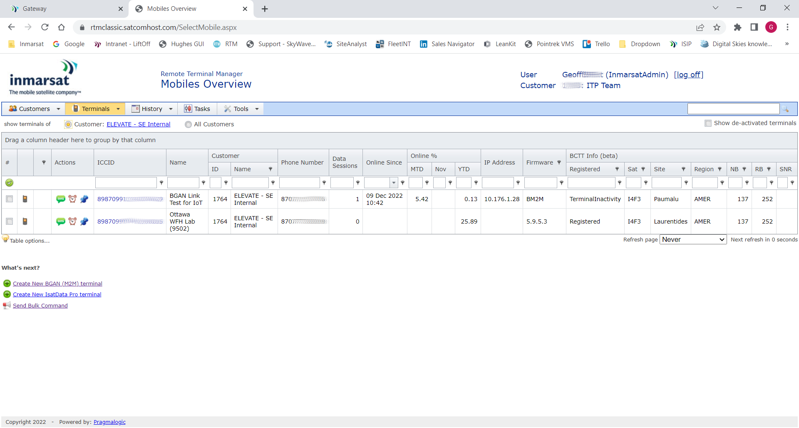
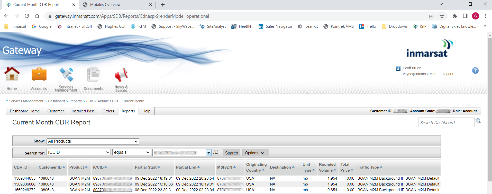

## Network Data

1. Using the **Inmarsat Solutions Gateway Portal** select
**Services Management > Remote Terminal Manager** then click
the link to *Remote Terminal Manager*.

1. Select **Terminals > Select Terminal** and you should see your terminal's
SIM ICCID in the list. If the terminal is online you should see a valid
IP address and a Registered status.

    

1. Using the **Gateway** portal, select **Services Management > Dashboard**,
then select **Reports > CDR > Airtime CDRs - Current Month**.

    

>:information_source: BGAN **CDR** (Call Data Record) files are generated every
2 hours or 2 MB of data use, whichever occurs first.

[Back to Developer Kit Quick Start](../README.md#Getting-Started)