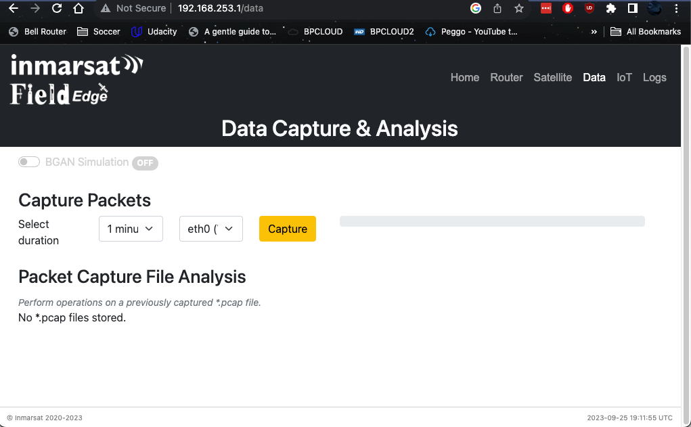
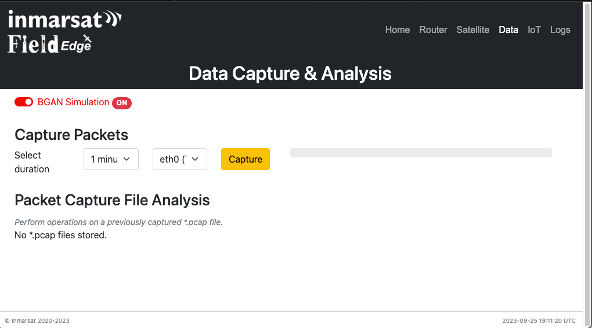
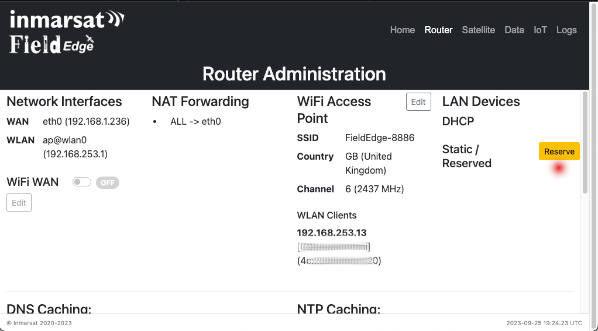
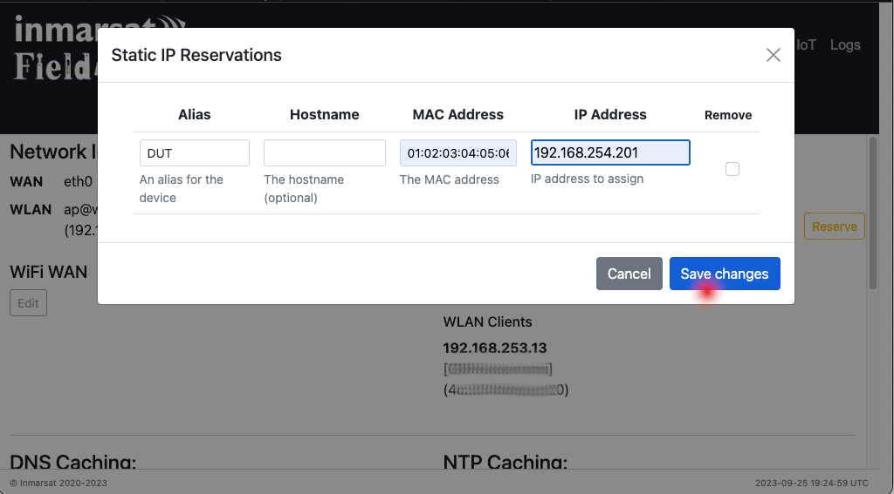
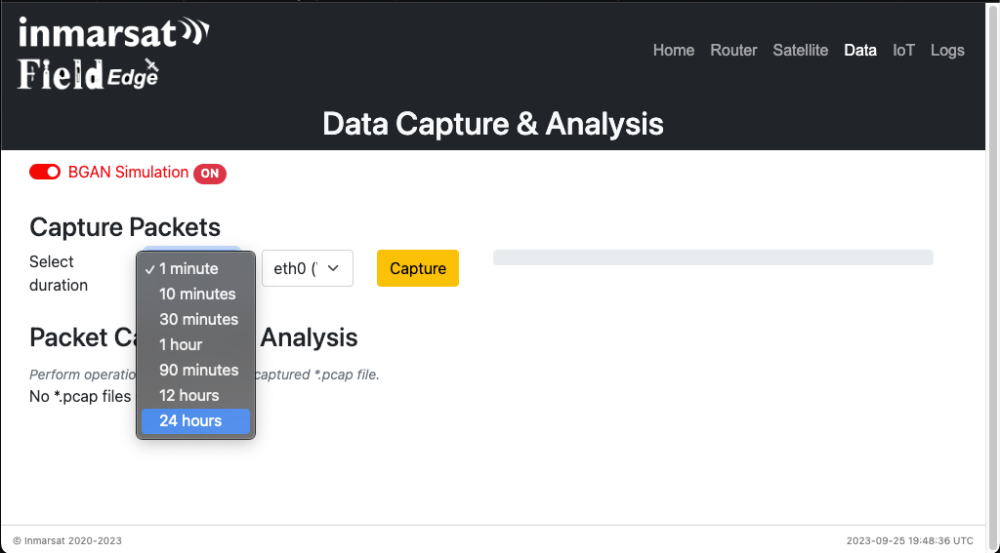
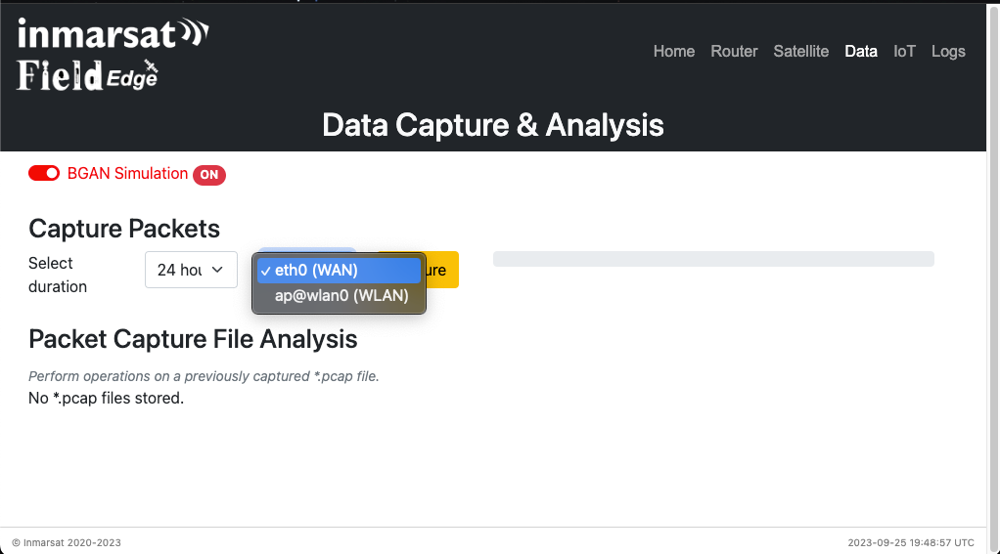
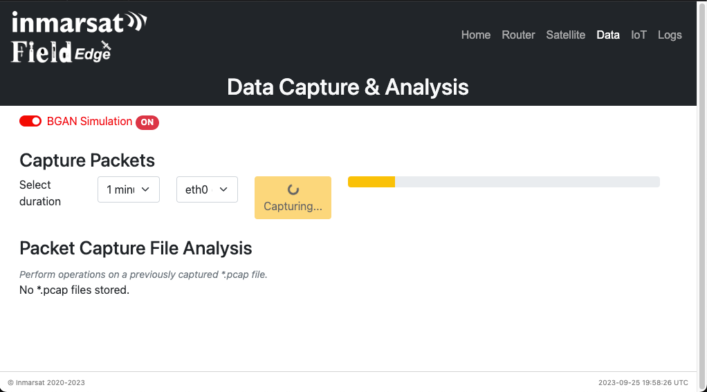
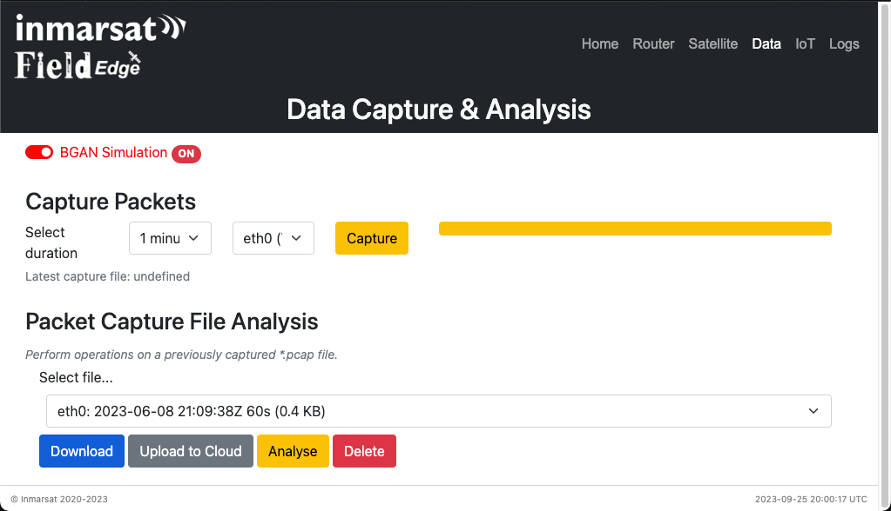

# Application Data Analysis

The idea of using the BGAN IoT developer kit is to enable you to ensure your
IoT application works over satellite connectivity in an efficient and
cost-effective way such that you can scale to mass deployment. The process
is envisioned as:

1. Test your application as-is using the *BGAN simulation* feature of the kit.
Validate that the simulated latency and throughput do not adversely affect your
customer experience.

1. Run a packet capture in simulation mode for a period of time representative 
of a repeating operational cycle of your application.

1. Discuss the analysis of your data capture with a Viasat solution architect
to collaborate on ways to improve performance, cost and scalability. This may
include (but not limited to):
    * Adjust TCP or higher layer protocol timeouts to compensate for latency;
    * Filter repeated requests such as DNS lookup and NTP using caching tools;
    * Filter unexpected background requests using firewall filters or
    a HTTP/S proxy;
    * Use UDP transport where possible for protocols with higher-layer
    acknowledgements;
    * Apply compression technologies;
    * Apply encryption technologies

## BGAN Simulation

The ***FieldEdge*** device is built on a Linux core and we use native
Linux *traffic control* techniques to simulate the latency and throughput
constraints of the BGAN network.

FieldEdge expects to have at least 2 physical Ethernet ports for simulation:
* **WAN** port connects to your local wired Internet/router
* **LAN** port connects to your IoT *device under test* ("DUT")

Traffic control runs on both the WAN and LAN port to simulate both directions
of communication.

BGAN simulation is normally enabled/disabled using the *FieldEdge GUI*, which
runs automatically on start-up of the FieldEdge device and can be accessed
via its local WiFi access point.

### Connect to the FieldEdge GUI

The WiFi Access Point (WAP) and GUI launch automatically a few minutes after
FieldEdge system boot.

1. Ensure your FieldEdge device has its SDHC card installed with the
pre-configured build for your system (Debian or OpenWRT).
>The FieldEdge image for Raspberry Pi uses Debian (Bullseye).

1. Power up the FieldEdge device. Using a PC/tablet/phone to scan available
WiFi networks, wait until you see a network **`FieldEdge-nnnn`**
where *nnnn* is a unique 4-hexadecimal ID.
>WiFi AP may take 1-2 minutes to come up with the unique code after first boot.
Subsequent boots should be quicker.

1. Connect to the FieldEdge WiFi access point using the password `IsatIoT1!`.

1. Using a browser on your PC/tablet/phone, input `192.168.253.1` in the URL
bar.

    >The GUI may take a few minutes after boot before the web server is accessible.

1. Connect the main Ethernet (WAN) port of FieldEdge to your Internet router or
home local area network. FieldEdge uses DHCP to acquire an IP address on your
LAN.

    >If you have access controls on your LAN network you may need to authorize
    the FieldEdge device as a client.

### Use the FieldEdge GUI to enable BGAN simulation

>**NOTE** you do not need a BGAN terminal to run simulation. In fact having a
BGAN terminal connected to FieldEdge should prevent simulation mode from being
enabled!

The easiest way to enable BGAN simulation is using the *FieldEdge GUI*. The
GUI launches automatically a few minutes after FieldEdge system boot.

After connecting to your FieldEdge WAP, you should be able to browse to
`http://192.168.253.1` or `http://fieldedge` and see the System Overview page.

1. Click the **Data** tab at the top right to view the
Data Capture & Analysis page.

    

1. Click the greyed out **BGAN Simulation** toggle button at the top, it should
turn from grey to red and indicate **ON**.

    >**NOTE** BGAN simulation uses Linux traffic control and slows down all network
    interactions so web page responsiveness may be slower while simulating.

    

1. Connect your own Device Under Test to the secondary Ethernet (LAN) port of
FieldEdge. Your device should be configured to use DHCP, and the FieldEdge will
act as a DHCP server and perform Network Address Translation (NAT) for your DUT.

    >If your FieldEdge device does not have a secondary Ethernet port you will
    need a USB/Ethernet adapter connected to the FieldEdge USB.

    >If your DUT does not support DHCP you can reserve a static IP address using
    the **Router** page of the FieldEdge GUI.
    See [instructions](#use-a-reserved-static-ip-for-your-device-under-test)

1. Run and observe your application as your normally would.

>*NOTE: Simulation can also be enabled using a shell script accessed via SSH*
*into the FieldEdge device.*

### Frequently Asked Questions on Application Behaviour

1. Many TCP/IP based applications use short timers. With typical 1-2 second
latency on the BGAN network this can cause timeouts and retransmissions. In
some cases the application will seem to not work.
    * Check your DUT documentation or contact the manufacturer to determine
    how to increase timeouts on your device.

1. Some applications require a certain throughput to deliver reasonable quality,
for example video.
    * Depending on the application, Viasat may have partner tools or solutions
    to help improve performance. For example video compression and tuning.

### Use a Reserved static IP for your Device Under Test

Your device should be configured with an IP address in the `192.168.254.0/24`
subnet for example `192.168.254.201`.

    >You will need to know the MAC address of your device.

1. Using the FieldEdge GUI select the **Router** tab.

1. Click the **Reserve** button near the upper right of the page.

    

1. Fill in the form with your selected IP address and the MAC address of
your device.

    

### Run a Packet Capture

The next step after getting your basic application connectivity working over
BGAN simulation, is to capture a packet trace to examine data consumption.

>Excess data consumption increases your cost of operation and could even degrade
your customer experience.

1. Click the **Data** tab at the top right to view the
Data Capture & Analysis page.

    

1. Under the **Capture Packets** section select a duration representative of
a repeating cycle or reasonable amount of time for your application to operate.

    

1. Under the **Capture Packets** section ensure the **WAN** interface is
selected.

    

1. Click **Capture** and wait for the capture to complete. It will run in the
background if you leave it or disconnect from the FieldEdge WAP.

    

1. After the capture is complete the **Packet Capture File Analysis** section
should show a list of captured files. You can then select to:
    * **Download** locally to your PC/tablet/phone
    * **Upload to Cloud** by configuring AWS-S3 or Azure Blob Storage settings
    * **Analyse** (*Experimental*) see a visualisation of data use
    * **Delete** if your FieldEdge is running low on storage or you are
    returning a loaned kit

    
