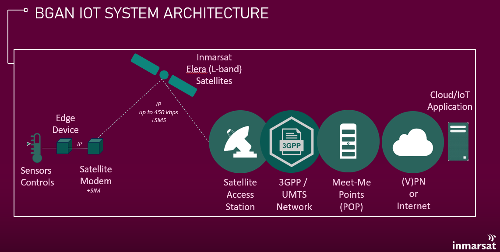
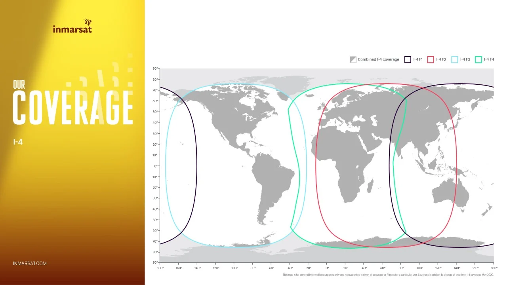

# Broadband Global Area Network System Overview

* An ***Edge Device*** (e.g. IoT gateway, SCADA RTU, data logger, etc.) connects
to the satellite ***UT*** (User Terminal aka User Equipment aka modem),
typically using Ethernet. The UT houses a ***SIM*** (Subscriber Identity Module)
that must be activated for IP and SMS service within the 3GPP network.
    >Communication Service Providers with a roaming agreement with Inmarsat
    may place their own SIM into the BGAN terminal and manage it within their
    own network.

* Native IP data gets sent over the satellite link and stays within the Inmarsat
private network until it reaches the ***MMP*** (Meet-Me Point) where it is
handed off to a customer private connection or the Internet, based on the
configuration of an ***Access Point Name*** provisioned on the SIM.

* The IP address of the remote device is typically assigned by a communication
service provider and may be dynamic or static, public or private depending on
the customer's requirements. Routing and firewall services are often provided
by the communication service provider as well.

* Latency is typically higher and throughput lower on the BGAN network compared
to "terrestrial" networks, sometimes requiring adjustment of parameters such
as packet or protocol timeouts.

The hardware components of the BGAN Developer Kit focus on the *UT* and tools
for assessing and adjusting IP parameters, as well as ***Edge Intelligence***
to optimize/reduce application data use to maximize the value of a solution.

## Global Coverage

BGAN is a global service offered on Inmarsat's geostationary ***Elera***
(L-band) satellites.

>NOTE: Some countries may require special licensing to offer service, you
can find out more by contacting your local Inmarsat or partner representative.

[Back to Developer Kit Quick Start](../README.md#Getting-Started)